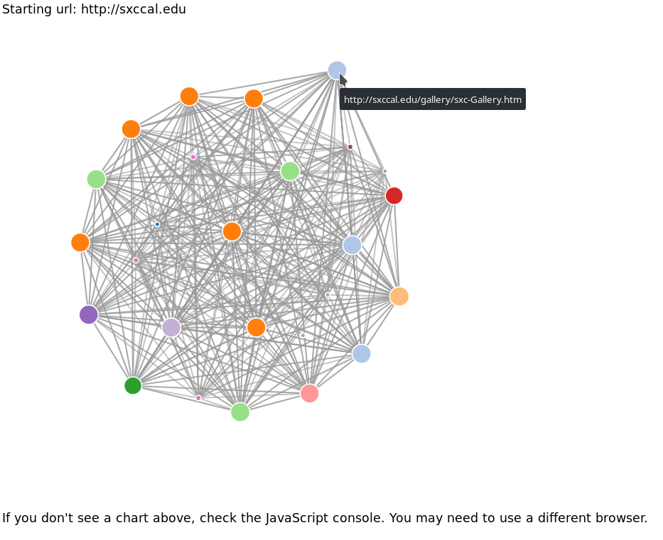
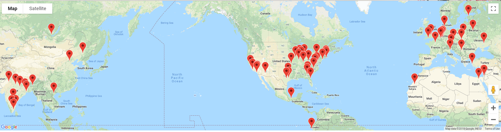
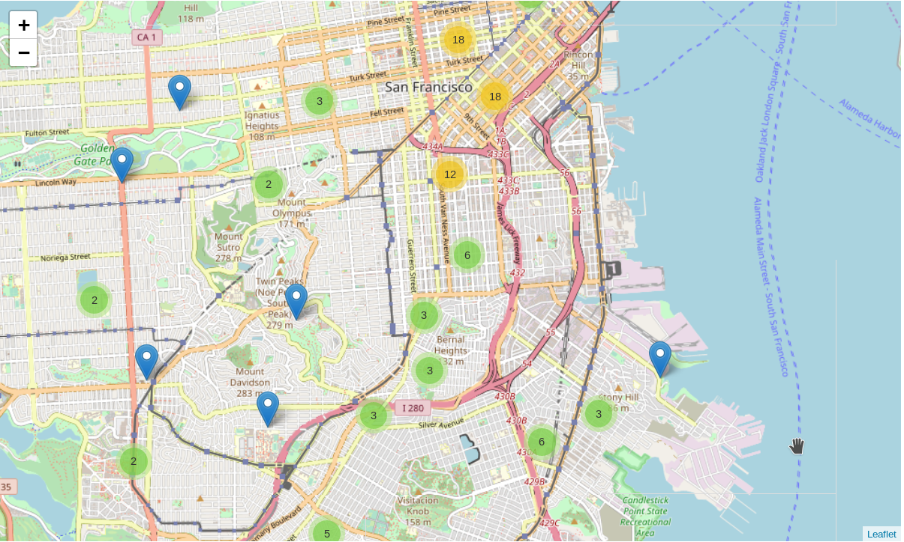
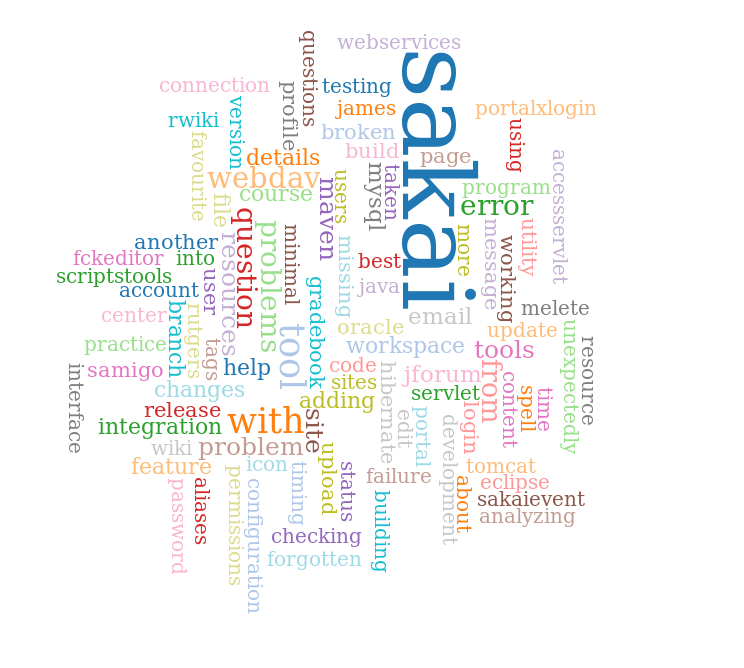
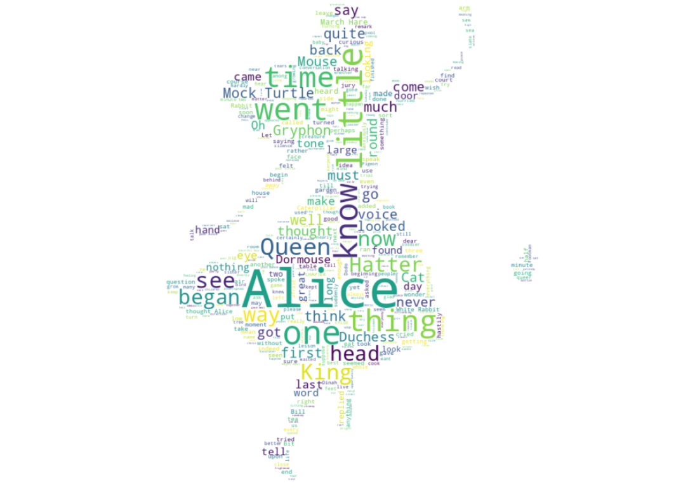

# MAJOR PYTHON COURSES OF COURSERA   

Most of the programs' backup from Coursera's Course.

## Note : 
* :beginner: -> beginner
* :green_book: -> moderate/average
* :orange_book: -> challenging

1 This repository contains the following folders :  :clipboard:
---
* [MICHIGAN STATE UNIVERSITY - DR CHUCK'S PYTHON FOR EVERYBODY](https://github.com/Jimut123/COURSERA_PYTHON/tree/master/MICHIGAN)  :beginner:
* [RICE - PYTHON FOR PROGRAMMING ESSENTIALS](https://github.com/Jimut123/COURSERA_PYTHON)   :beginner:
* [IBM - PYTHON SPECIALIZATION](https://github.com/Jimut123/COURSERA_PYTHON/tree/master/IBM)    :green_book:
* [TORONTO - PYTHON](https://github.com/Jimut123/COURSERA_PYTHON/tree/master/TORONTO)  :beginner:
* [FUNDAMENTALS OF COMPUTING - RICE](https://github.com/Jimut123/COURSERA_PYTHON/tree/master/FUND_OF_COMP_RICE)  :green_book:
* [APPLIED DATA SCIENCE - MICHIGAN](https://github.com/Jimut123/COURSERA_PYTHON/tree/master/APPL_DATA_SCI_MICH) :beginner:

2 Maintainer : 
---
[Jimut Bahan Pal](https://www.linkedin.com/in/jimut-bahan-pal-156862123/)

3 Highlights (Cool Visualizations) :
---

#### Pager-rank

#### Geo-Data Visualizations:

#### Data-Chart Visualization of Sakai Project:

#### San Fransisco Map:

#### Word cloud :

#### Word cloud ver 2:

****

